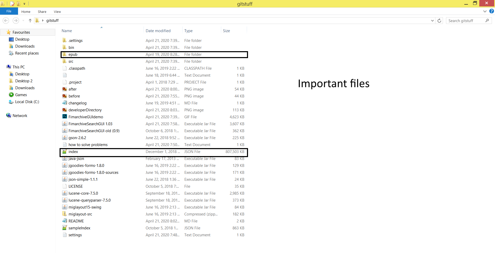

# FimarchiveSearchGUI

(the gif is outdated, the prequel/sequel finder is complete now)

A program to search and filter Fimarchive, which is an archive of every story on Fimfiction.net.
To get Fimarchive - at the time of writing, a 5.9 GB file, [go here](https://www.fimfiction.net/user/116950/Fimfarchive/blog) and click on Direct: Official (if you want to try out the program without download a 5.9 GB file, instructions below)

The program was tested on Windows, it might or might not work on other operating systems

## To use without compiling (for non-programmers who just want to search stuff)

Download FimarchiveSearchGUI(version).jar

Download Fimarchive (the 5.9 GB file)

Extract index.json from Fimarchive (approximately 800 MB json file)

Extract the epub folder from Fimarchive (if Windows file explorer crashes, use 7zip)

Put FimarchiveSearchGui(version).jar, index.json and the epub folder in the same directory and run FimarchiveSearchGUI(version).jar

Follow the built-in instructions in the text box

This is what the directory should look like before you run the program the first time

This is what it should look like after running it the first time

## To compile and run in Eclipse IDE (Haven't tested this on a different PC, don't know if it works)

Clone the repo onto your PC

Put everything in a folder in your Eclipse workspace
/eclipseWorkspaceFolder/FimarchiveSearchGUI/all the files go here

Compile and run FimArchiveSearchGUI.java

What the directory should look like if you're doing this

## To compile and run in Eclipse IDE __without downloading a 5.9 GB file__

Same as above, but go into FimArchiveSearchGUI.java and set useSampleIndex to true. This will use a 1 MB sampleIndex.json which comes with the project, and only contains a small portion of the proper index.json.

